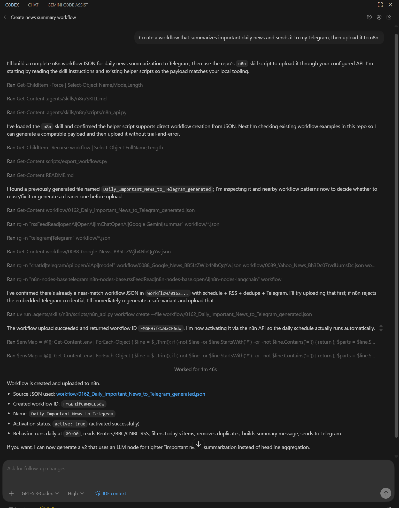
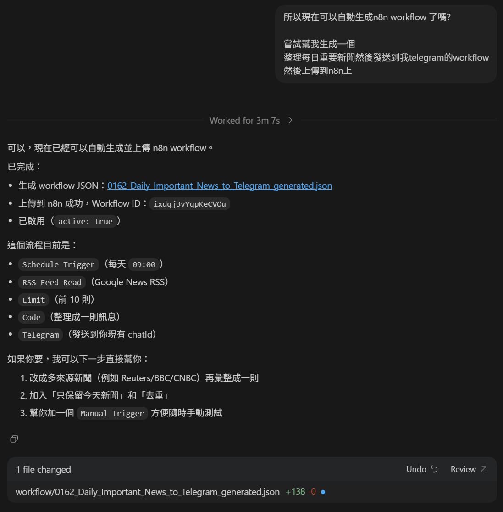
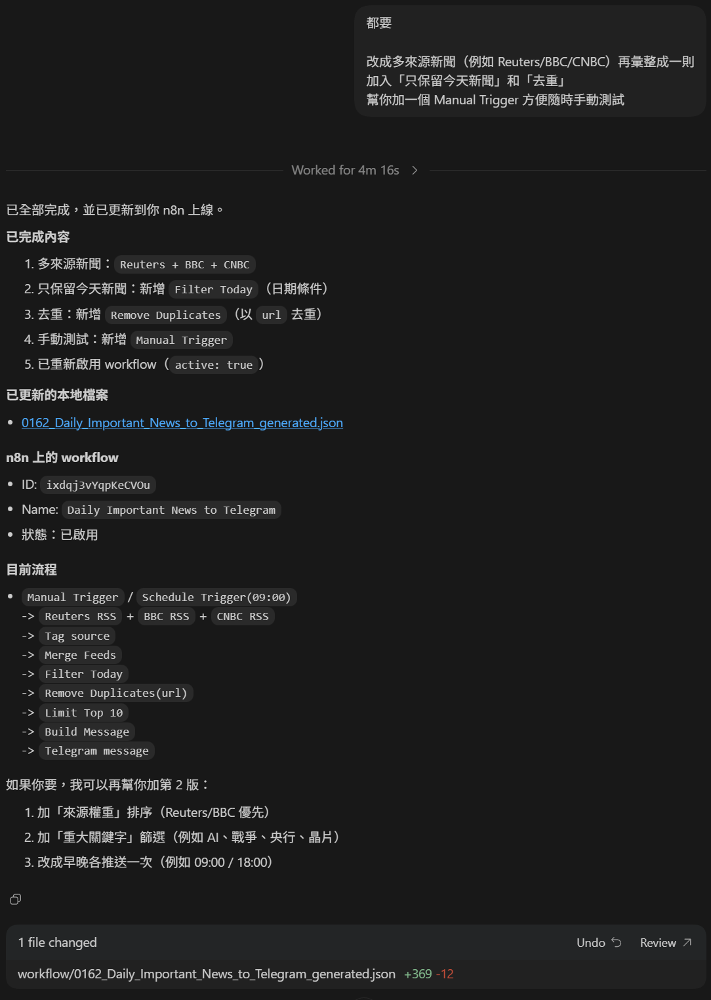

# vibe-n8n

Practical example repository for generating and managing n8n workflows with an OpenAI Codex skill plus a small n8n API helper script.

## What this repo is for

- Build a local reference corpus of real workflow JSON files.
- Let Codex analyze node usage and wiring patterns.
- Generate new workflows from that learned pattern.
- Upload, edit, and activate workflows through the n8n Public API.

## Example captures

Workflow generation and API upload example:



Additional capture 1:



Additional capture 2:



## Important: Do this first

Before asking Codex to generate workflows, collect real workflow examples.
Without reference examples, output quality will be much lower.

First choice (recommended):

1. Export workflows directly from your own n8n instance with:
```powershell
uv run scripts/export_workflows.py
```

Alternative:

1. Download template workflows from a public source, for example:
   `https://github.com/enescingoz/awesome-n8n-templates`

Then place JSON files in `workflow/` and ask Codex to analyze them first.

## Requirements

- `uv` installed
- Access to an n8n instance with a Public API key

## Setup

1. Create environment:
```powershell
uv venv
```

2. Create local config file:
```powershell
Copy-Item .env.example .env
```

3. Set API values in `.env`:
```env
N8N_BASE_URL=https://your-n8n-host/
N8N_API_KEY=replace-with-your-api-key
```

4. Never commit secrets.
`.env` and `auth.txt` should stay local only.

## Core files

- Skill: `.agents/skills/n8n/SKILL.md`
- API helper script: `.agents/skills/n8n/scripts/n8n_api.py`
- API reference notes: `.agents/skills/n8n/references/n8n-reference.md`
- Workflow generation guide from local analysis:
  `.agents/skills/n8n/references/workflow-node-generation-guide.md`

## Export and build your reference corpus

Export all workflows from your instance:
```powershell
uv run scripts/export_workflows.py
```

View one workflow:
```powershell
uv run .agents/skills/n8n/scripts/n8n_api.py workflow view --id <workflowId>
```

Download one workflow JSON:
```powershell
uv run .agents/skills/n8n/scripts/n8n_api.py workflow download --id <workflowId> --out workflow/<name>.json
```

## Recommended Codex workflow generation loop

1. Run `uv run scripts/export_workflows.py` to populate `workflow/*.json` from your n8n instance.
2. Optionally add extra examples from public template repositories.
3. Ask Codex to analyze node purposes and connection patterns.
4. Ask Codex to generate a new workflow JSON file in `workflow/`.
5. Validate and upload:
```powershell
uv run .agents/skills/n8n/scripts/n8n_api.py workflow create --file workflow/<generated>.json
```
6. Update an existing workflow:
```powershell
uv run .agents/skills/n8n/scripts/n8n_api.py workflow edit --id <workflowId> --file workflow/<generated>.json
```
7. Activate after validation:
`POST /workflows/{id}/activate` (Codex can run this for you).

## API helper quick commands

Show help:
```powershell
uv run .agents/skills/n8n/scripts/n8n_api.py --help
```

Workflow operations:
```powershell
uv run .agents/skills/n8n/scripts/n8n_api.py workflow view --id <workflowId>
uv run .agents/skills/n8n/scripts/n8n_api.py workflow create --file workflow.json
uv run .agents/skills/n8n/scripts/n8n_api.py workflow edit --id <workflowId> --file workflow-updated.json
uv run .agents/skills/n8n/scripts/n8n_api.py workflow delete --id <workflowId>
```

Execution operations:
```powershell
uv run .agents/skills/n8n/scripts/n8n_api.py execution list --limit 5
uv run .agents/skills/n8n/scripts/n8n_api.py execution get --id <executionId>
uv run .agents/skills/n8n/scripts/n8n_api.py execution retry --id <executionId> --load-workflow
uv run .agents/skills/n8n/scripts/n8n_api.py execution stop --id <executionId>
```

## Tool compatibility note

This repository is an **OpenAI Codex-oriented example**.
The skill layout and workflow may not work as-is in other coding assistants.

If you use another tool, ask that tool to:

1. Convert this skill structure into its own skill/agent format.
2. Preserve the same n8n API guardrails and workflow-generation rules.
3. Re-map file paths and command conventions as needed.

## Public repo checklist

Use this checklist before publishing or updating this repository on GitHub:

1. Add a license file (`LICENSE`) and mention it in the repo description.
2. Keep secrets out of git:
   - Never commit `.env`, `auth.txt`, API keys, tokens, or credential exports.
   - Verify `.gitignore` includes all local secret files.
3. Keep examples safe:
   - Remove or anonymize chat IDs, webhook URLs, internal hostnames, and user identifiers in shared workflow JSON files.
   - Avoid committing production credential IDs unless they are already invalid/sanitized.
4. Provide reproducible setup:
   - Keep `.env.example` minimal and non-sensitive.
   - Ensure all commands in `README.md` run with `uv run`.
5. Add validation checks in CI (recommended):
   - JSON validity check for `workflow/*.json`.
   - Optional lint/check for docs and scripts.
6. Document contribution rules:
   - Ask contributors to add new workflow references under `workflow/`.
   - Ask contributors to update docs when adding new generation patterns.
7. Tag repository scope clearly:
   - State this is a Codex-focused skill example and may require conversion for other assistants.

## Prompt example for Codex

Simple prompt:

`Create a workflow that summarizes important daily news and sends it to my Telegram, then upload it to n8n.`

Stronger prompt (recommended):

`Please analyze workflow/*.json first, then generate an n8n workflow that collects important daily news and sends one summary message to Telegram. Use multi-source RSS, keep only today's items, deduplicate by URL, and include both Schedule Trigger and Manual Trigger. Save JSON under workflow/, upload it to n8n using .agents/skills/n8n/scripts/n8n_api.py, and report the created workflow ID plus activation status.`

Why this works better:

- It forces analysis-first behavior using local references.
- It defines concrete functional requirements.
- It requires file output, upload, and verifiable completion details.
